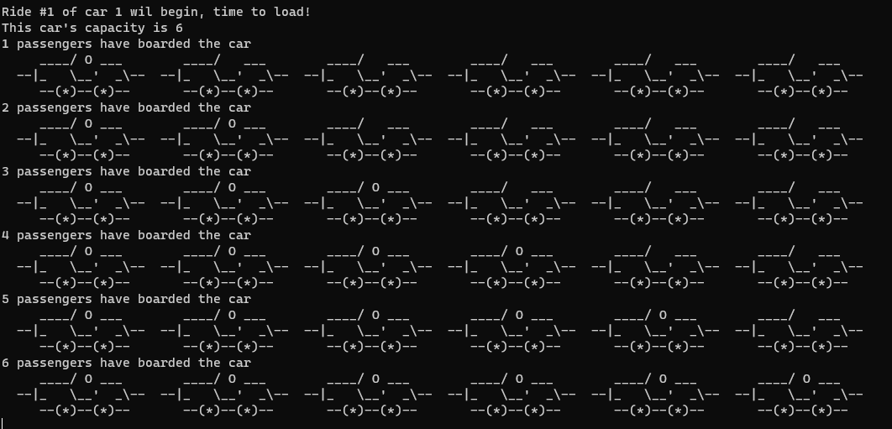

# Projeto `Multithread` - Sistemas Operacionas

> Projeto com o objetivo de implementar uma aplicação multithread que utiliza semáforos, mutex locks e variáveis de condição para sincronização, juntamente com uma animação para visualizar o problema. Nossa inspiração foi o problema Multi-car Roller Coaster do livro [The Little Book of Semaphores](https://greenteapress.com/semaphores/LittleBookOfSemaphores.pdf) de Allen B. Downey, o qual será melhor descrito adiante.

## Table of Contents

- [Projeto `Multithread` - Sistemas Operacionas](#projeto-multithread---sistemas-operacionas)
  - [Table of Contents](#table-of-contents)
  - [Integrantes do grupo](#integrantes-do-grupo)
  - [Apresentação](#apresentação)
  - [Como executar?](#como-executar)
    - [Bibliotecas necessárias](#bibliotecas-necessárias)
  - [Descrição do problema](#descrição-do-problema)
    - [Condições relevantes à solução:](#condições-relevantes-à-solução)
  - [Visualização](#visualização)
  - [Referências](#referências)

## Integrantes do grupo 
- Breno Vitral Harris - 246973
- Clara Mattos Medeiros - 247021
- Isabella Ribeiro Rigue - 234618
- Larissa Ayumi Okabayashi - 247220

## Apresentação

[Slides sobre o problema proposto]() 

## Como executar?
Para executar o código é preciso ter todas as bibliotecas necessárias instaladas, mencionadas abaixo. Após isso, basta compilar o código, colocando a flag -pthread, e rodar o executável gerado.

### Bibliotecas necessárias

- stdio.h 
- unistd.h 
- pthread.h 
- semaphore.h 
- time.h

## Descrição do problema

Esse problema trata o funcionamento de uma montanha-russa com vários carrinhos e passageiros. 
Suponha que existam n threads de passageiros e n threads de carrinho. Os passageiros aguardam repetidamente para dar voltas no carrinho, que acomodam no máximo C passageiros, onde C é menor que n. 

### Condições relevantes à solução:
- Como os carrinhos percorrem a mesma pista e, portanto, não podem se ultrapassar, eles farão o desembarque na mesma ordem que fizeram o embarque.
- Múltipos carrinhos podem estar correndo na pista ao mesmo tempo.
- O carrinho só poderá percorrer a pista quando estiver cheio ou quando a quantidade total de passageiros for menor que a capacidade do carrinho e todos os passageiros tenham embarcado. 
- Somente um carrinho pode estar embarcando por vez.
- Somente um carrinho pode estar desembarcando por vez.
- o carrinho indica quando está está realizando um embarque, andando na pista ou realizando um desembarque.
- Os passageiros não podem embarcar até que o carrinho tenha sinalizado que está realizando um embarque, assim como não poderão desembarcar até que um desembarque seja sinalizado.
- O último passageiro a embarcar comunica o fim do embarque.

## Visualização

Ao rodar o executável é possível ver uma animação representando os carrinhos e os passageiros, conforme a imagem abaixo. Foi utilizada a impressão de caracteres ASCII para essa implementação.

## Referências 

Allen B. Downey. The Little Book of Semaphores. Green Tea Press, 2008.

Gregory R. Andrews. Concurrent Programming: Principles and Practice.
Addison-Wesley, 1991.

ALVES, G. multithread-drifting. Disponível em: <https://github.com/sp0oks/multithread-drifting/tree/master>. Acesso em: 18 maio. 2023.

ThreadMentor: The Roller Coaster Problem. Disponível em: <https://pages.mtu.edu/~shene/NSF-3/e-Book/SEMA/TM-example-roller.html>. Acesso em: 18 maio. 2023.

‌